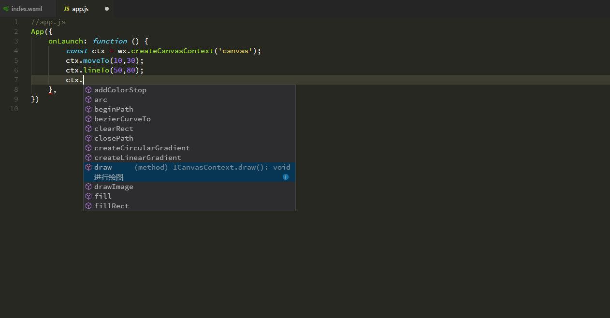
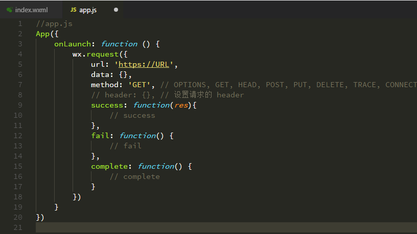
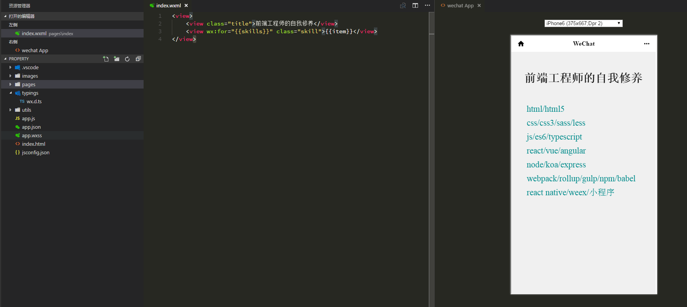

# vscode-wechat 

wechat app support for vscode(version v1.6.0+)

## preview

### command

    1. Open the command list (Press F1 or Ctrl + Shift + P)

    2. Select `Preview Wechat App`

### keybindings

    1. Press Ctrl + F8

## screeshot

 . 

 . 

 . 

 . 